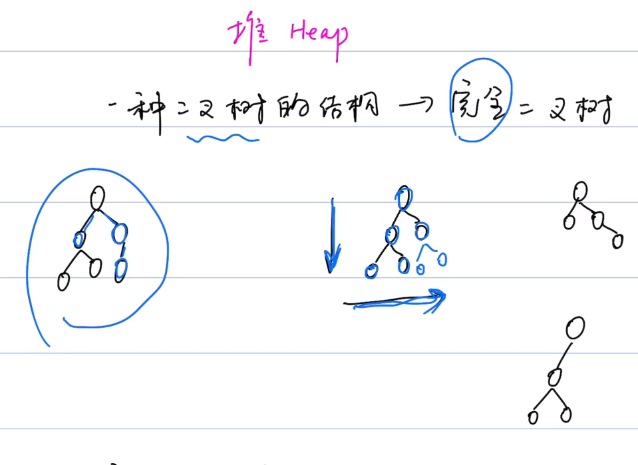

## Part1 数据结构

1. 数组
2. 链表
3. 队列
4. 栈
5. 哈希表
6. 集合
7. 树
8. 堆
9. 图

### 1.1 数组 

#### 四部曲时间复杂度

1. 访问（Access）：
2. 搜索（Search）：
3. 插入（Insert）：
4. 删除（Delete）：

#### 基础语法:point_down:

| 常用操作     | python3 | Java |
| ------------ | ------- | ---- |
| 1.创建数组   |         |      |
| 2.添加元素   |         |      |
| 3.访问元素   |         |      |
| 4.修改元素   |         |      |
| 5.删除元素   |         |      |
| 6.遍历元素   |         |      |
| 7.查找元素   |         |      |
| 8.数组的长度 |         |      |
| 9.数组排序   |         |      |

### 1.2 链表
#### 四部曲时间复杂度

1. 访问（Access）：

2. 搜索（Search）：

3. 插入（Insert）：

4. 删除（Delete）：

### 1.3 队列

#### 特点：先进先出（FIFO：First In First Out）

#### 分类：

1. 单端队列 Queue
2. 双端队列 Deque

#### 四部曲时间复杂度（就是链表）

1. 访问（Access）：
2. 搜索（Search）：
3. 插入（Insert）：
4. 删除（Delete）：

#### 队列基本操作

##### 出入队原则：左头右尾，头进尾出

| 常用操作   | Python3 | Java |
| ---------- | ------- | ---- |
| 1.创建队列 |  |  |
| 2.添加元素（==入队==） |  |  |
| 3.获取即将出队的元素 |  |  |
| 4.删除元素（==出队==） |  | |
| 5.判断队列是否为空 |  | |
| 6.队列长度 |  |  |
| 7.遍历队列（==边删除边遍历==） |  |  |

### 1.4 栈Stack

#### 特点：先进先出（LIFO：Last In First Out）

#### 四部曲时间复杂度（就是链表）

1. 访问（Access）：  --  栈顶元素
2. 搜索（Search）：
3. 插入（Insert）：
4. 删除（Delete）：  --  栈顶元素

#### 栈的常用操作

|      | Python3 | Java |
| ---- | ------- | ---- |
| 1.创建栈 |  |  |
| 2.添加元素（==入栈==） |         |             |
| 3.获取即将出栈的元素 |   |        |
| 4.删除元素（==出栈==） |   |                       |
| 5.判断栈是否为空 |     |     |
| 6.栈长度 |                          |                 |
| 7.遍历栈（==边删除弹栈边遍历==） |       |      |

### 1.5 哈希表 Hash Table

|                   | Python3                                                      | Java                                                         |
| ----------------- | ------------------------------------------------------------ | ------------------------------------------------------------ |
| 1.创建哈希表      |  |
| 2.添加元素        |               |  |
| 3.修改元素        |     |  |
| 4.删除元素        |               |  |
| 5.获取元素        |   | |
| 6.检查key是否存在 |          |  |
| 7.哈希表长度 |  |  |

### 1.6 集合Set

#### 特点：

1. 无序
2. 不重复

#### 作用：

1. 检查某个元素是否存在
2. 找出重复元素

#### 分类：

1. HashSet:star:
2. LinkedList set
3. Tree Set

#### 四部曲时间复杂度:

1. 访问（Access）：
2. 搜索（Search）：
   * 无哈希冲突：
   * 有哈希冲突：
3. 插入（Insert）：
   * 无哈希冲突：
   * 有哈希冲突：
4. 删除（Delete）：
   * 无哈希冲突：
   * 有哈希冲突：

#### 基本操作：

|              | Python3                                               | Java                                                         |
| ------------ | ----------------------------------------------------- | ------------------------------------------------------------ |
| 1.创建集合   |   |  |
| 2.添加元素   |  |        |
| 3.查询元素   |   |   |
| 4.删除元素   |   |   |
| 5.集合的长度 |   |  |

### 1.7 树Tree

#### 3个概念：

深度、高度、层

#### 二叉树分类：

1. 普通二叉树
2. 满二叉树
3. 完全二叉树--ps：我记得有判断是否为完全二叉树的题

#### 二叉树3种遍历（这个顺序是指==根节点的遍历位置==）：

1. 前序遍历
2. 中序遍历
3. 后序遍历

#### 练习题：

144 前序遍历

94 中序遍历

145 后序遍历

### 1.8 堆Heap

#### 定义： 

1. 完全二叉树（一种二叉树的结构）
2. 每个节点 >= or <= 孩子节点 （大顶堆 or 小顶堆）

#### 特点：

​	大顶堆：最大值 -->  堆顶元素

​	小顶堆：最小值 -->  堆顶元素

#### 四部曲时间复杂度

1. 访问（Access）：
2. 搜索（Search）：  --  **只搜**==堆顶元素==
3. 插入（Insert）：
4. 删除（Delete）：  --  栈顶元素

**Note：**插入时，只跟父节点作比较；删除时，只跟子节点作比较，不会比较左右节点

#### 堆的常用操作

|                              | Python3                                                      | Java                                                         |
| ---------------------------- | ------------------------------------------------------------ | ------------------------------------------------------------ |
| 1.创建堆（大顶堆 \| 小顶堆） |  |  |
| 2.添加元素                  |  |  |
| 3.获取堆顶的元素            |  |  |
| 4.删除堆顶元素              |  |  |
| 5.堆的长度                   |  |  |
| 6.堆的遍历                  |  |  |

KeyPoint：Python无法直接创建一个最大堆，可以把所有元素取负，堆化后，取元素再取反，负负得正

#### 堆化操作

时间复杂度是 O(n)

### 1.9 图Graph

#### 必知概念：

1. 顶点
2. 邻居节点
3. 边
4. 度（degree）
   * 出度：多少边从这个顶点为起点指向别的顶点
   * 入度：多少边指向该顶点
5. 无向图和有向图和权重图

#### 图的算法：

