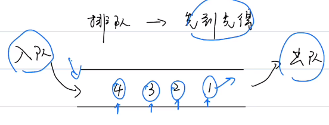
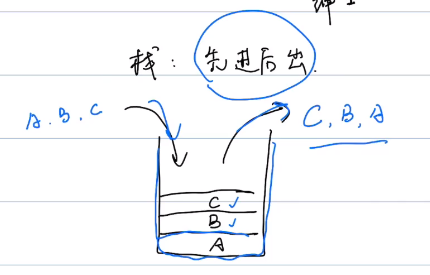
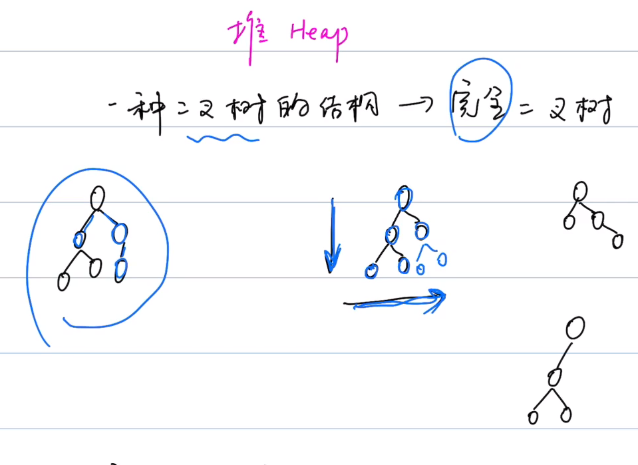
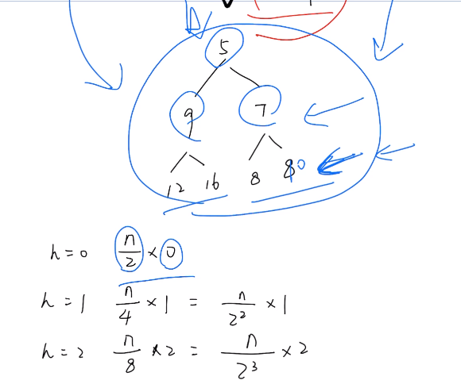
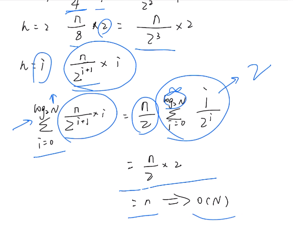

## Part1 数据结构

1. 数组
2. 链表
3. 队列
4. 


### 1.1 数组 

#### 重点：区分==访问（Accesas）==和==搜索（Search）==

* 访问:arrow_right:索引
* 搜索:arrow_right:元素

#### 四部曲时间复杂度

1. 访问（Access）：O(1)
2. 搜索（Search）：O(n)
3. 插入（Insert）：O(n)
4. 删除（Delete）：O(n)

#### 应用场景

##### 	==读多写少==

#### 基础语法:point_down:

| 常用操作     | python3                                                      | Java                                                         |
| ------------ | ------------------------------------------------------------ | ------------------------------------------------------------ |
| 1.创建数组   | a = []                                                       | int[] a = {1,2,3};<br/>int[] b = new int[]{1,2,3};<br/>int[] c = new int[3];<br/>ArrayList<Integer> arr = new ArrayList<>() |
| 2.添加元素   | a.append()<br/>a.insert(index,element)                       | arr.add(element);<br/>arr.add(index, element);               |
| 3.访问元素   | a[index]                                                     | arr.get(index);<br/>a[index];                                |
| 4.修改元素   | a[index] = new_num                                           | arr[index] = new_num;<br/>arr.set(index, element);           |
| 5.删除元素   | a.remove(element)<br/>a.pop(index)<br/>a.pop()  # 最后一个元素 | arr.remove(index)                                            |
| 6.遍历元素   | for e in a<br/>for index, element in enumerate(a)<br/>for i in range(len(a)): | for (int i = 0; i < arr.length; i++)<br/>for  (int i = 0; i < arr.size(); i++) |
| 7.查找元素   | a.index(index)                                               | boolean is99 = arr.contains(99);                             |
| 8.数组的长度 | len(a)                                                       | arr.length<br/>arr.size()                                    |
| 9.数组排序   | a.sort()<br/>a.sort(reverse = True)                          | Array.sort(arr);<br/>Collection.sort(arr);                   |

#### 练习题：

485. ##### 最大连续1的个数

解法一：更新最大和

```
func(nums)->int:
    if nums is null or nums.length == 0
    	return 0
    count = 0
    result = 0
    for (i = 0; i < nums.length; i = i+1)
    	if nums[i] == 1
    		count = count+1
    	else
    		result = max(result,count)
    		count = 0
    result = max(result,count)
    return result		
```

解法二：滑动窗口

```python
```

#### Leetcode练习题

485. ##### 移动零

486. ##### 移动元素


### 1.2 链表
#### 四部曲时间复杂度

1. 访问（Access）：O(n)

2. 搜索（Search）：O(n)

3. 插入（Insert）：O(1)

4. 删除（Delete）：O(1)

#### Leetcode练习题

leetcode 203：单向链表要先考虑两件事 （1）需不需要dummy head （2）需要多少个移动指针，除了遍历其他都是2个以上


leetcode 206：

​	解法一：反转链表需要3个指针

​	解法二：新建一个dummy head，需要两个移动指针，每次遍历到一个元素就尾插进dummy head的链表中

​	解法三：递归，还没细想


### 1.3 队列

#### 特点：先进先出（FIFO：First In First Out）

#### 分类：

1. 单端队列 Queue
2. 双端队列 Deque

#### 四部曲时间复杂度（就是链表）

1. 访问（Access）：O(n)
2. 搜索（Search）：O(n)
3. 插入（Insert）：O(1)
4. 删除（Delete）：O(1)

#### 队列基本操作

##### 出入队原则：左头右尾，头进尾出



| 常用操作   | Python3 | Java |
| ---------- | ------- | ---- |
| 1.创建队列 | from collections import deuqe<br/>q = deque() | import java.util.LinkedList;<br>import java.util.Queue;<br><br/>Queue<String> queue = new LinkedList<String>(); |
| 2.添加元素（==入队==） | q.appendleft(element) | queue.offer("a"); |
| 3.获取即将出队的元素 | tmp = q[-1] | string tmp = queue.peek(); |
| 4.删除元素（==出队==） | q.pop() | queue.poll(); |
| 5.判断队列是否为空 | if len(q): | queue.isEmpty(); |
| 6.队列长度 | len(q) | queue.size(); |
| 7.遍历队列（==边删除边遍历==） | while len(q):<br/>    print(q.pop()) | for (queue.size() > 0) {<br/>    tmp = q.poll();<br/>    System.out.println(tmp);<br/>} |

#### Leetcode练习题

933.最近的请求次数

python3

```python
from collections import deque

class RecentCounter:

    def __init__(self):
        # 1.初始化一个队列
        self.q = deque()

    def ping(self, t: int) -> int:
        while len(self.q) > 0:
            # 2.获得队列的尾巴元素
            rear = self.q[-1]
            # 3.如果队头元素和即将入队元素的差大于3000，则弹出尾巴
            if t - rear > 3000:
                self.q.pop()
            else:
                break
        self.q.appendleft(t)
        return len(self.q)
```


Java

```Java
```


239.滑动窗口的最大值

```python
from collections import deque

class Solution:
    def maxSlidingWindow(self, nums: List[int], k: int) -> List[int]:
        # 1.双指针法就能实现滑动窗口，但是如果存入队列的是元素，那么需要每滑动一次就遍历一次窗口，
        # 时间复杂度达到 m（窗口大小） x n（滑动次数）
        # 2.所以换个思路，若我们每次放入的是下标呢，利用单调双端队列，每次放进去元素先判断一下
        left = 0
        right = 0
        q = deque()
        ret = []
        # 2.1 右边界指针移动到数组元素末尾则停
        if len(nums) == 0:
            return ret
        while right < len(nums):
            # 2.2 当右指针-左指针 > (窗口大小 - 1)，左指针也开始移动
            if right - left > k - 1:
                left += 1

            # 2.3 如果队头元素小于等于即将加进来的元素，队头出队
            if len(q) > 0 and q[0] < left:
                q.popleft()
            # 2.4 一直出队，直至队头元素大于即将入队的元素
            while len(q) > 0 and nums[q[-1]] <= nums[right]:
                q.pop()     
            q.append(right)

            if right - left == k - 1:
                ret.append(nums[q[0]])

            right += 1
        
        return ret
```

Java

```java
```


### 1.4 栈Stack

#### 特点：先进先出（LIFO：Last In First Out）



#### 四部曲时间复杂度（就是链表）

1. 访问（Access）：O(1)  --  栈顶元素
2. 搜索（Search）：O(n)
3. 插入（Insert）：O(1)
4. 删除（Delete）：O(1)  --  栈顶元素

#### 栈的常用操作

|      | Python3 | Java |
| ---- | ------- | ---- |
| 1.创建栈 | # 用 list 或者 deque 实现栈<br>stack = [] | import java.util.*;<br>Stack<Integer> st = new Stack<Integer>(); |
| 2.添加元素（==入栈==） | stack.append(element)                     | st.push();                                                   |
| 3.获取即将出栈的元素 | tmp = stack[-1]                           | st.peek();                                                   |
| 4.删除元素（==出栈==） | stack.pop()                               | st.pop();                                                    |
| 5.判断栈是否为空 | if len(stack)                             | st.empty()                                                   |
| 6.栈长度 | len(stack)                                | st.size()                                                    |
| 7.遍历栈（==边删除弹栈边遍历==） | while len(stack):<br/>    stack.pop()     | while (st.size()>0){<br/>    st.pop();<br/>}                 |

#### 练习题

##### 20.Valid Parenthese 有效的括号

##### 496.Next Great Element 下一个更大的元素

分析问题，是从该元素的后面，那么想一下，有什么数据结构是从后面一层一层逼近头部，答案就是**==栈==**

##### python

第一眼方法：

```python
# 时间复杂度为 O(m*n)
from collections import deque

class Solution:
    def nextGreaterElement(self, nums1: List[int], nums2: List[int]) -> List[int]:
        ret = []
        # 1.遍历数组nums1
        for i in range(len(nums1)):
            # 2.把nums2转换为栈
            st = deque(nums2)
            isEnd = False
            maxVal = -1

            while len(st) > 0 and not isEnd:
                top = st.pop()
                if top > nums1[i]:
                    maxVal = top
                elif top == nums1[i]:
                    isEnd =True
            
            ret.append(maxVal)

        return ret
```

2.优化方法：

下一个最大值有映射关系，要想到哈希表

```python
# 时间复杂度是 O(m+n)

```


### 1.5 哈希表 Hash Table

|                   | Python3                                                      | Java                                                         |
| ----------------- | ------------------------------------------------------------ | ------------------------------------------------------------ |
| 1.创建哈希表      | # Create by Array<br>hashTable = [''] * 4<br/># Create by Dictionary<br/>mapping = {} | // Create by Array<br/>String[] hashTable = new String[4];<br/>// Create by Dictionary<br/>HshMap<Integer, String> map = new HshMap<Integer, String>(); |
| 2.添加元素        | hashTable[1] = 'hello'<br/>mapping['hello'] = 1              | //<br/>hashTable[1] = 'XiaoMing';<br/>//<br/>map.put(1, 'XiaoHong'); |
| 3.修改元素        | hashTable[1] = 'hello Jake'<br/>mapping['hello'] = 520       | //<br/>hashTable[1] = 'XiaoMing01';<br/>//<br/>map.put(1, 'XiaoHong08'); |
| 4.删除元素        | hashTable[1] = ''<br/>mapping.pop('hello')                   | //<br/>hashTable[1] = '';<br/>//<br/>map.remove(1); |
| 5.获取元素        | hashTable[1]<br/>mapping['hello']                            | //<br/>String tmp = hashTable[1];<br/>//<br/>map.get(1); |
| 6.检查key是否存在 | key_name in mapping                                          | map.containsKey(3); |
| 7.哈希表长度 | len(mapping)                                          | map.size();<br/>map.isEmpty(); |


### 1.6 堆Heap



#### 定义： 

1.  完全二叉树（一种二叉树的结构）
2. 每个节点 >= or <= 孩子节点 （大顶堆 or 小顶堆）

#### 特点：

​	大顶堆：最大值 -->  堆顶元素

​	小顶堆：最小值 -->  堆顶元素

#### 四部曲时间复杂度

1. 访问（Access）：X
2. 搜索（Search）：O(1)  --  **只搜**==堆顶元素==
3. 插入（Insert）：O(logN)
4. 删除（Delete）：O(logN)  --  栈顶元素

**Note：**插入时，只跟父节点作比较；删除时，只跟子节点作比较，不会比较左右节点

#### 堆的常用操作

|                              | Python3                                                      | Java                                                         |
| ---------------------------- | ------------------------------------------------------------ | ------------------------------------------------------------ |
| 1.创建堆（大顶堆 \| 小顶堆） | import heapq<br>minheap = []<br/>heapq.heapify(minheap)      | import java.util.*;<br>Stack<Integer> st = new Stack<Integer>(); |
| 2.添加元素                   | heapq.heappush(minheap, 10)<br/>heapq.heappush(minheap, 8)<br/>heapq.heappush(minheap, 9)<br/>heapq.heappush(minheap, 2)<br/>heapq.heappush(minheap, 1)<br/>heapq.heappush(minheap, 11) | st.push();                                                   |
| 3.获取堆顶的元素             | tmp = minheap[0]                                             | st.peek();                                                   |
| 4.删除堆顶元素               | heapq.heappop(minheap)                                       | st.pop();                                                    |
| 5.堆的长度                   | len(minheap)                                                 | st.empty()                                                   |
| 6.堆的遍历                   | while len(minheap):<br/>    heapq.heappop(minheap)           | while (st.size()>0){<br/>    st.pop();<br/>}                 |

KeyPoint：Python无法直接创建一个最大堆，可以把所有元素取负，堆化后，取元素再取反，负负得正

#### 练习题

251.数组中第k个最大元素

692.前k个高频单词 

#### 堆化操作

时间复杂度是 O(n)







